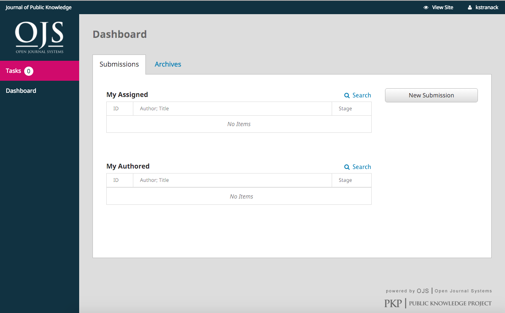

# Chapter 5: Authoring For Authors

To make a submission to an OJS 3 journal, you will first need to register as an Author (see [Registering](registration/md). After that, when you login, you will be taken to your dashboard. It is currently empty as you have made no submissions.

To start a new submission, select the New Submission button on the right side of the screen.

From here, you will be taken to the first step of the five step process. You will need to select the most appropriate section for your submission (if you aren’t sure, make your best guess), read and check the Checklist boxes, add any comments for the editor, read the journal’s privacy statement, and then hit the Save and Continue button to move to the next step.

 
On Step 2, a window will open allowing you to upload your submission file.

First, however, you MUST select an Article Component. This lets the system know whether the file is the body of the manuscript, an image, a data set, etc. **This must be selected before your file will upload**.

Once you’ve made that selection, you can then upload your first file. It is important to note that you can only upload **one** file at a time. Additional files can be uploaded later in the process. Typically, this first file will be the body of your manuscript. Hit the Continue button once the file uploads.

> Note: we’re currently looking at replacing this upload tool with something more user-friendly.

After uploading the file, you will be asked to add some metadata describing your work, including a filename for internal document management (e.g., Stranack Article Text). Select the Continue button.

On the final tab, you have the option to upload another file (e.g., a dataset or an image). Once you have finished uploading all of your files, hit Complete.

This will take you back to the second step of the submission process, where you can see a list of all of the files you’ve uploaded (and make any necessary changes using the Edit Metadata link. Hit Save and Continue to move to the next step.

On step 3, you will be asked to fill in more metadata, including the title of the submission (broken down into prefix, title, and subtitle), the abstract, and scrolling down...

...any additional contributors.

You can add more contributors (e.g., co-authors), by selecting the Add Contributors link. This will open a new window with fields to enter their information.

Hit Save, and the new contributor will appear on the screen.

Scrolling down, you will see a series of metadata fields. Fill in all that are relevant to your work. There is also a References field where you can paste in the reference list from your article. These references will be visible on the abstract page of your published article.

Hit Save and Continue to move forward.

Note: We’re currently exploring how many of these metadata fields to display by default, if some should be hidden unless a Journal Manager enables them, etc. We’re trying to find the balance between the journal’s need for detailed metadata and the author’s need for a pleasing user experience.

On step 4, you will be asked to confirm that everything is in order. If it is, hit Finish Submission.

A box will pop up asking you to confirm you are finished. Hit OK.

Your submission is now complete! The editor has been automatically notified of your submission and you can now wait for a response.

At this point, you can follow the links to review your submission, make another submission, return to your dashboard, or logout of the system.

If you’d like to try this for yourself, visit: http://journals.sfu.ca/uiux/index.php/publicknowledge/

Please send us any feedback you have on the submission process as we’ve designed it for OJS 3, either by commenting directly in this document or via email (kstranac@sfu.ca).

