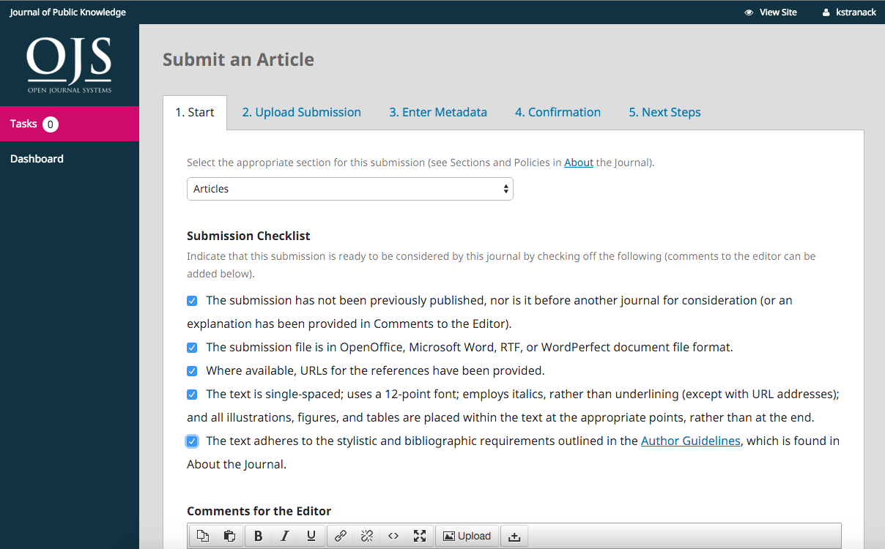
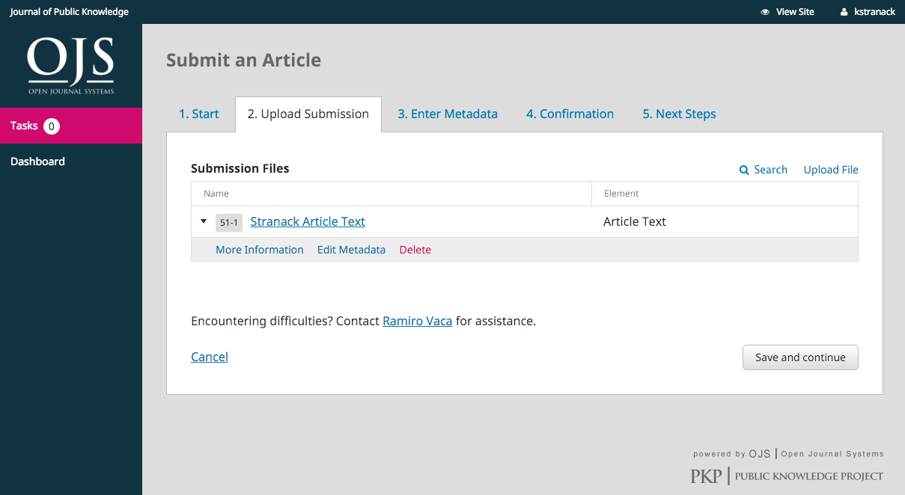
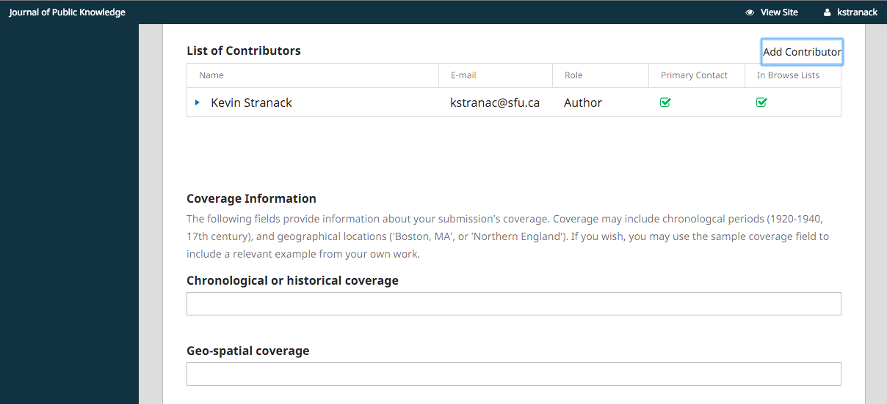
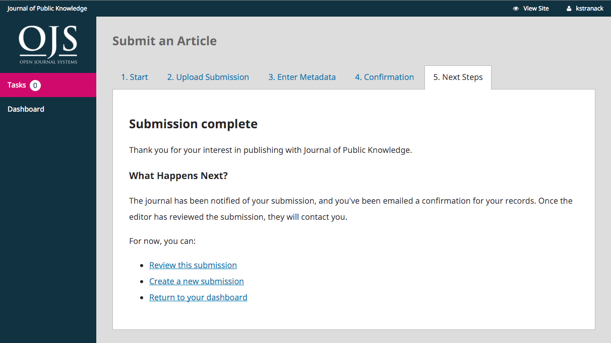

# Chapter 5: Authoring (For Authors!)

## Registering with the System

To make a submission to an OJS 3 journal, you will first need to register as an Author (see [Registering](registration/md). After that, when you login, you will be taken to your dashboard. It is currently empty as you have made no submissions.

## Submitting an Article

**Login** to the system. You will be taken to your dashboard. It will be empty as you have made no submissions.

Start a new submission by clicking the ‘**New Submission**’ button on the right side of the screen.

From here, you will be taken to **Step 1** of a 5-Step process to upload and describe your submission. To begin select the appropriate section for your submission (e.g., article, review, etc.). If you aren’t sure which section is appropriate, make your best guess. Read and agree to the statements in the submission checklist by checking each box. Include any comments for the editor, read the journal’s privacy statement, and then click the **‘Save and Continue**’ button to move to **Step 2**.

 
On **Step 2**, a window will open allowing you to upload your submission file.

First, however, you MUST select an Article Component. This lets the system know whether the file is the body of the manuscript, an image, a data set, etc. **This must be selected before your file will upload**.

Once you’ve made that selection, you can then upload your first file. It is important to note that you can only upload **one** file at a time. Additional files can be uploaded later in the process. Typically, this first file will be the body of your manuscript. Hit the **Continue** button once the file uploads.

> Note: we’re currently looking at replacing this upload tool with something more user-friendly.

After uploading the file, you will be asked to name the file. To ensure a blind review, do not include any identifying information in your filename. Click the ‘**Continue**’ button.

In ‘Finishing up’ you have the option to repeat the process to upload additional files (e.g., a data set or an image). 
Once you have finished uploading all of your files, click ‘**Complete**;’ this will close the upload window.

You will be brought back to the ‘submit an article screen’ where you will see the files you’ve uploaded. If you need to make changes, expand the arrow and make any changes using the ‘Edit Metadata’ link. 

Click ‘Save and Continue’ to move to Step 3.

On **Step 3**, you will be asked to add more information about the submission, including the title of the submission (broken down into prefix, title, and subtitle), the abstract, and scrolling down...

...any additional contributors.

You can add more contributors (e.g., co-authors), by clicking the ‘**Add Contributors**’ link. This will open a new window with fields to enter their information.

Hit **Save**, and the new contributor will appear on the screen.

Depending on the journal you are submitting to, you may see additional fields to complete. 
 
Click ‘**Save and Continue**’ to move forward.

> Note: We’re currently exploring how many of these metadata fields to display by default, if some should be hidden unless a Journal Manager enables them, etc. We’re trying to find the balance between the journal’s need for detailed metadata and the author’s need for a pleasing user experience.

On Step 4, you will be asked to confirm that you are happy with your submission. 

Click ‘**Finish Submission**.’

A box will pop up asking you to confirm you are finished. Click **OK**.

Your submission is now complete! The editor has been notified of your submission. At this point, you can follow the links to:

- Review your submission
- Create a new submission
- Return to your dashboard

Now wait. You may be contacted for additional information or revisions prior to your article being sent to peer review. If this is the case, you will receive an email notifying you of any required changes. Login to your submissions page to respond to the request.  Under ‘my authored’, click the ‘Submission’ link. 

You will see a table with pre-review discussions, where you can view and respond to the comments, and attach any required files. This will send the submission back to the editor, who will send it out for review. 

## Responding to a review

Interacting with your manuscript during the review process will be done mainly in the Review tab of the submitted article. The Review tab is comprised of 4 sections:

- Notifications 
  - Listed here are editorial decisions
- Reviewer’s attachments
  - Loaded here are any attachments from reviewers
- Revisions
  - Where you will upload revised files
- Review discussions
  - Comment/discussion section where you can communicate with the editor

[screenshot here of blank review stage]

To see the editor’s decision, click on the ‘editor’s decision’ link in the notifications section. Here you will see the decision and any reviewer comments that were included. If the reviewer has attached any documents, you can access these in the next section.

[screenshot]

You will upload revisions in the revisions section. To upload a revised file click on ‘Upload file.’ A new window will open allowing you to upload your file(s). Select the appropriate option from the dropdown menu to indicate you are submitting a revised file.

[screenshot]

You can use the discussion section to communicate with the editor. You have the option to start a new discussion, or continue a discussion thread by clicking on the discussion name and clicking on the ‘add message’ button.

[screenshot]

You will be notified by email when the review stage is complete. At this point  the Editor may send your submission to the copyediting stage.

## Resubmit for review

If the editor’s decision is to resubmit for review, you will need to log in and select the article in your submissions page. The resubmission is done in the review stage, there is no need to start a new submission. 

At the review stage you will need to do two things to resubmit once you have revised your document:

Upload the new file in the revisions section. To upload a new file click on ‘Upload file.’ A new window will open allowing you to upload your file(s). Select the appropriate option from the dropdown menu to indicate you not submitting a revision of an existing file.

Add a discussion to notify the editor that you have re-submitted. 

[screenshot]

## Copyediting

[screenshot copyedit]

Depending the journal, you may be required to approve copyedits. You will be notified in the system that you have pending copyedits.

The copyediting stage is mainly managed through the discussion feature.  You can respond to or  approve copyedits via the discussion dialogue box. You can also upload revised files if necessary. 

[screenshot discussion]

When you have approved the copyedits, the editor will send the file to the production stage. You will receive a notification email when it moves to this stage.

## Production

Depending the journal, you may be required to approve galleys in the production stage. These can be PDFs or HTML, they are the almost final version of the article which you will be invited to proofread. You will be notified in the system that you have a pending task. The production stage is managed through the discussion feature.  You can respond to or approve galleys via the discussion dialogue box. 

