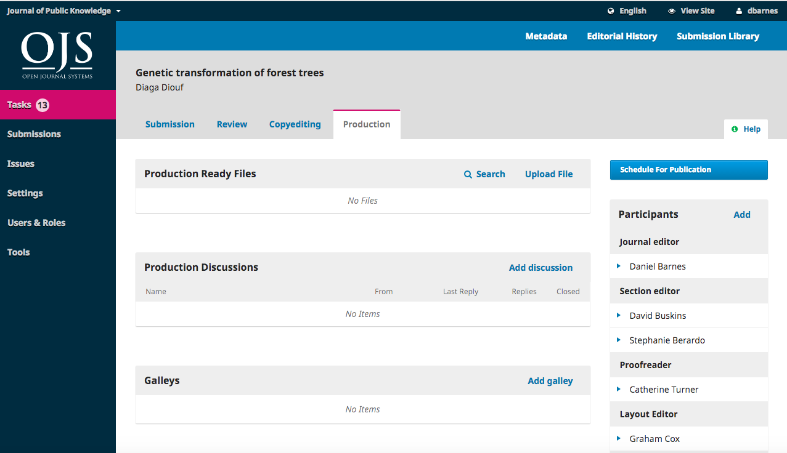

# Editorial Interface aka the Dashboard

OJS 3 now has a separate interface once you log into the editorial system. This not only makes it easier to customize the reader interface, but also provides OJS users of different journals a consistent experience.

The editorial interface is known as your **dashboard** and consists of the following elements:

1. **Top Navigation Bar**: To the left, you will find the name of the journal you are currently working with (e.g., Journal of Public Knowledge). If you are enrolled in more than one journal on this OJS installation, you can use this to switch between journals. To the right, you can switch languages if the journal is multilingual, view the reader interface, or click on your username to view your profile [link] or logout.
2. **Left Menu Panel**: These are the major sections of the dashboard, including your tasks (items needing immediate attention), the submissions, issue management, settings, user and role management, and tools. Users with fewer permissions (e.g., Authors) will see fewer links here.
3. **Blue Navigation Bar**: These menu choices are specific to the different sections of the editorial workflow. Metadata, Editorial History, and Submission Library are all part of the submission record visible below.
3. **Main Panel**: In the main panel you will see the current work area. In the image above, you are looking at a submission record.
4. **Main Panel Sub-Menus**: Within the Main Panel, you will often see tabs that allow you to view different information about the content being worked on. In this example, the submission record is broken four sections (Submission, Review, Copyediting, Production). Notice the Help tab to the right, which provides context-sensitive help.
4. **Right Panel**: From here, you can see the action buttons, such as Schedule for Publication. Different pages have different action buttons. Below the action buttons is the Participants table, which lists everyone (except Reviewers) involved in the submission.