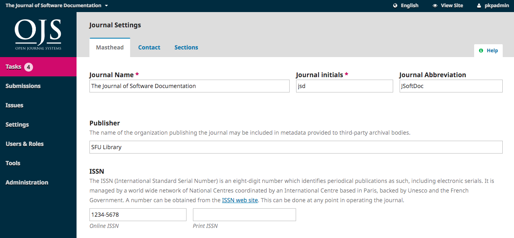
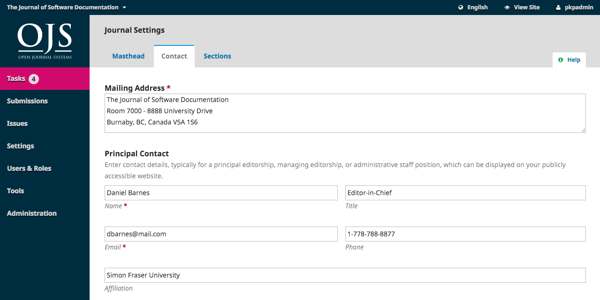
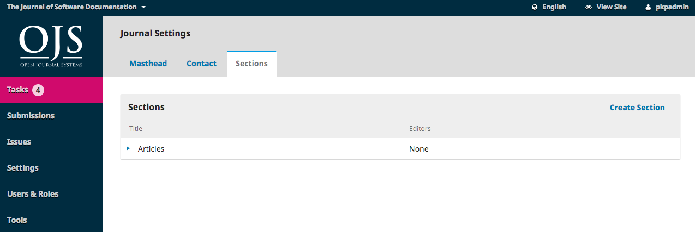
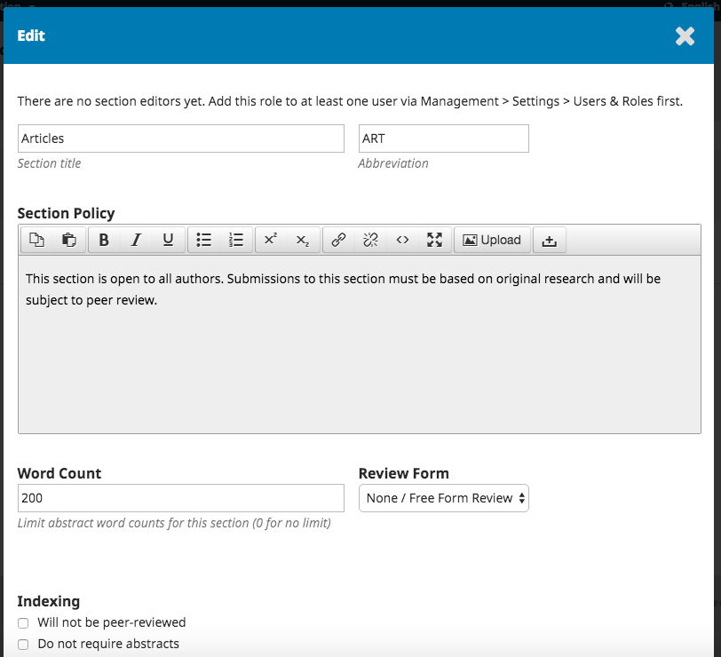
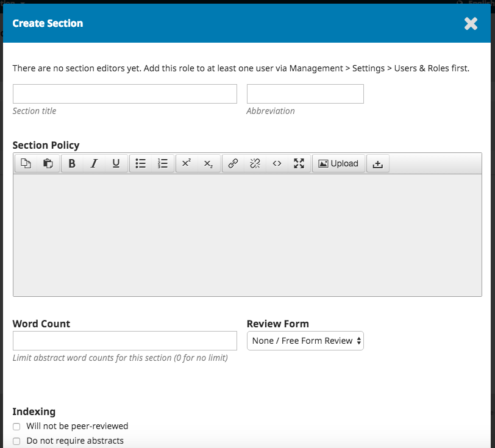

# Journal Settings

Journal Settings include details about the journal.

Use the tabs to navigate to the different sections of Journal Settings: Masthead, Contact, Sections.

##Masthead

**Journal Name** is the name of your journal. E.g., Journal of Software Documentation

**Journal Initials** are the initials of the journal. E.g., JSD.

**Journal Abbreviation** is the abbreviation of your journal name. E.g., JSoftDoc.

**Publisher** is the name of the organization publishing the journal.

**ISSN** (International Standard Serial Number) is an eight-digit number which identifies journals. It is managed by a world wide network of National Centres coordinated by an International Centre based in Paris, backed by Unesco and the French Government. A number can be obtained from the [ISSN web site](http://www.issn.org/). This can be done at any point in operating the journal.

OJS journals will typically have an online ISSN, but some may also publish a print version, which requires a different print ISSN.

**Journal Summary** is a brief description of your journal. If you are on an OJS installation with multiple journals, this text will appear with your journal listing.

**Masthead** allows you to add the names of your editorial team or anyone else you wish to mention. This will appear on the public website under About > Editorial Team.

**About the Journal** is a space to add any information about your journal which may be of interest to readers, authors, or reviewers. 

This could include your open access policy, the focus and scope of the journal, copyright notice, sponsorship disclosure, history of the journal, a privacy statement, and inclusion in any LOCKSS or CLOCKSS archival system.

Hit the **Save** button to save your changes.

##Contact

Use this section to add journal contacts.

**Mailing Address**: Add your journal's official mailing address here. This will appear on the journal's Contact page.

**Principal Contact**: Add contact information for the journal's main contact person.

**Technical Support Contact**: Add contact information for the journal's technical support person. This information will appear on the journal's Contact page and also in different points in the workflow to offer assistance to users.

Hit the **Save** button to save your changes.

##Sections

Use this page to configure the different sections of your journal. E.g., Articles, Editorials, Reviews, Commentary, etc.

All of your existing sections will appear here. OJS requires at least one section, and creates an "Articles" section by default.

You can modify sections by clicking on the blue arrow to the left of the section name. This will reveal options to edit or delete the section.

###Editing a Section

Selecting the edit link will open a new window with different configuration options.

From here, you can change the name or abbreviation of the section.

**Section Policy**: Use this field to add important details such as submission requirements, peer review, etc.

**Word Count**: Use this to limit the number of words for abstracts in this section.

**Review Form**: You can select specific review forms for each section. Learn more about Review Forms here.

**Indexing**: Each section can have different indexing settings. For example, an Editorial section will not typically be peer-reviewed.

**Identify items published in this section as a(n)**: This used by some indexing systems. Note that it is not a required field.

Hit the **Save** button to save your changes and return to the Sections page.

###Create Section

From the sections page, select the Create Section link to open a blank window, exactly the same as the window used for editing a section described above.

Fill in the details and hit Save to record your work.