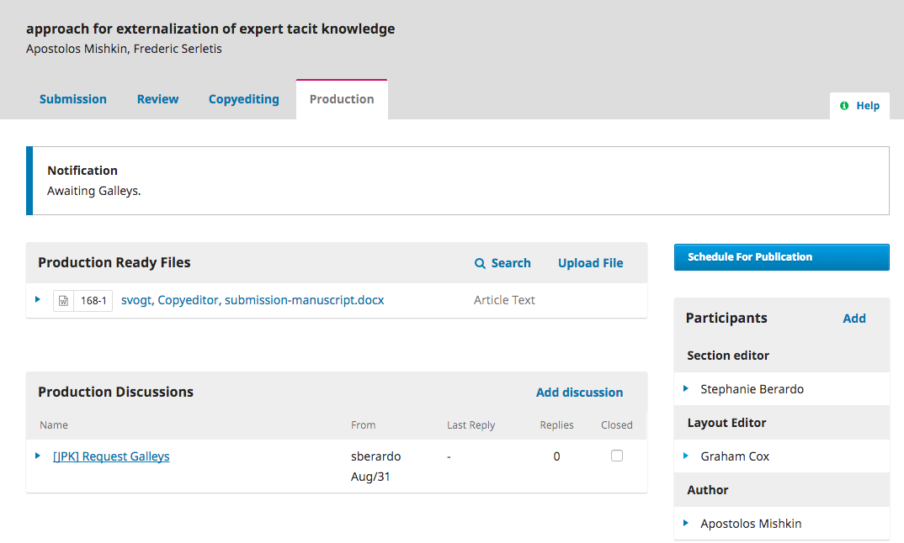
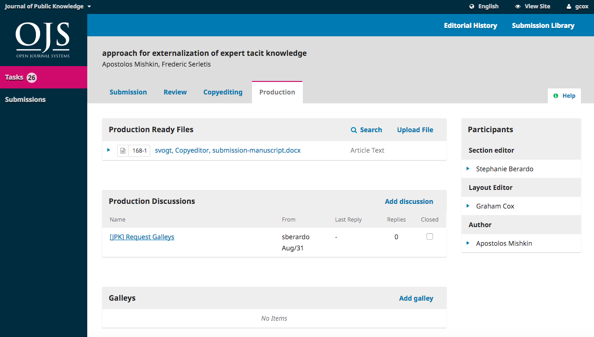
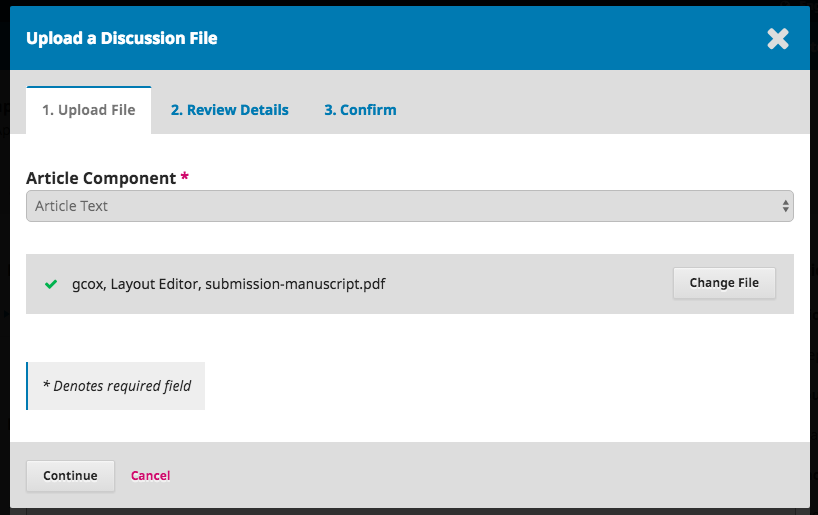
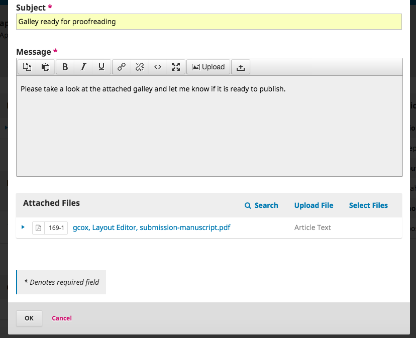

# Production

With the completion of the Copyediting stage, the submission now moves to Production. From here, the copyedit files (often Microsoft Word files) will be converted to publishable formats (e.g., PDF, HTML) and proofread before publishing.

To start working in Production, the Section Editor must login to the system and choose the submission from her dashboard.

Choosing the Production link will open the submission record.

You will see the copyedited files are now available in the *Production Ready Files* panel.

A notification banner also indicates that you must assign someone to create the galley files (e.g., the PDFs, HTML, etc.) from those production ready files.

This can vary from journal to journal -- you may have layout editors or production assistants to do this work.

To make the assignment, use the *Add* link in the Participants list. This will open a new window.

Use the role selector and search button to find appropriate users, select one, choose a predefined message, and hit **OK** to send.

The user has now been notified via email and in his dashboard.

Notice that the notification now indicates the submission is "Awaiting Galleys". You can see the layout editor in the Participants list, and you can see the request notice in the Production Discussions panel.

You can now wait for the Layout Editor to complete his tasks.

##Layout Editing

As the Layout Editor, you will have received a message inviting you to create the galleys for the submission.

To get started, login to the system and go to your dashboard.

From here, find the submission and select the Production link.

This will take you to the submission record.

From the Production Ready Files panel, download the files to your desktop and work outside of OJS to convert them to the formats appropriate for your journal (e.g., HTML, PDF, etc.).

> Note: PKP is currently working on a project to automate the conversion of Microsoft Word documents into other formats, including XML, HTML, PDF, EPUB, etc. Keep an eye on our blog for updates.

##Contact the Author

Next, you will want to share the PDF with the author for a final look and sign-off.

To so, use the *Add Discussion* link in the Production Discussion panel. This will open a new window.

Remember to add the author at the top of the window, and then add a subject and a message.

Before sending, however, attach a copy of the PDF file using the *Upload File* link. This will make it available to the author.

Remember to select the correct Article Component, and then upload the PDF.

Hit **Continue**.

Next, make any changes to the file name (usually you don't need to do anything here).

And then, you can upload additional files, if necessary.

Once you are done, hit **Complete**.

The file is now attached and you can send the message using the **OK** button.

The Author has now been notified and you can await his response.

##Author Response

Once the author has had a chance to review the galleys and respond, you will receive an email notification and will see a reply in the Production Discussions.

##Add Galleys

Now that the Author has proofread the galleys, you can make any final changes, an then upload them to the Galleys panel, using the *Add Galley* link.

