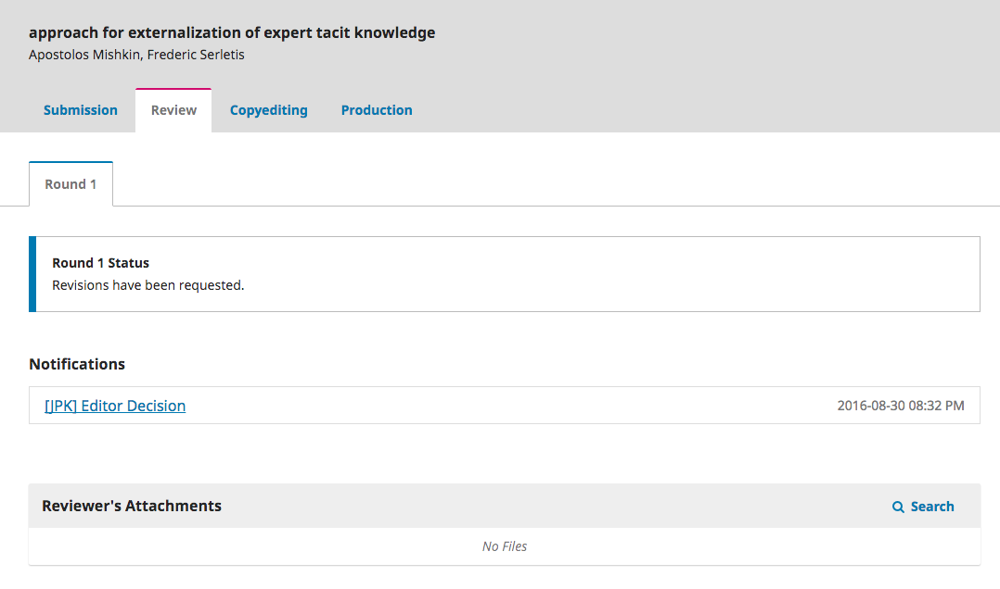
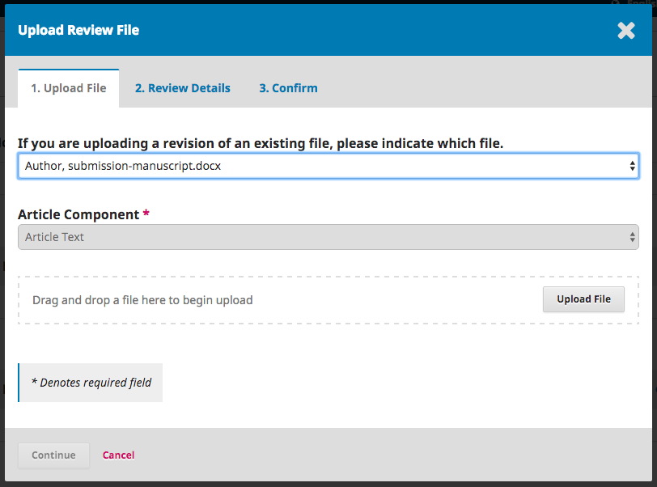

 # Responding to a Review
Once the review process has completed, you will be notified via email by the editor of their decision.

After receiving the email, login to your dashboard.

Select the *Review* link next to your submission to view the full record.

From here, you can see the decision (revisions requested) and a link to the editor's notification.

Based on the information in the editor's message, you must now prepare your revisions.

##Uploading the Revised File

By scrolling down the page, you will find a panel for **Revisions**.

Use the *Upload a File* link to upload your revised manuscript.

Use the dropdown menu to choose that you are uploading a revision of an existing file.

Then upload the revised file and hit **Continue**.

Check the file details and hit **Continue** again.

If you have any additional files to upload, do so now. Otherwise, hit **Complete**.

Your revised file is now visible in the Revisions panel.

##Inform the Editor

Your next step is to inform the editor that the revised file is now available. To do so, go to the Review Discussion panel.

From there, select the *Add Discussion* link.

Use the *Add User* link to add the editor.

Add a subject line and a message.

Hit **OK** to send the message.
