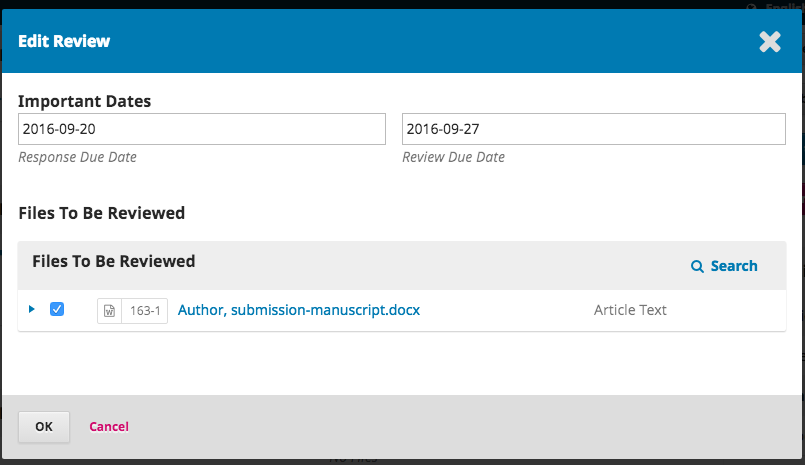
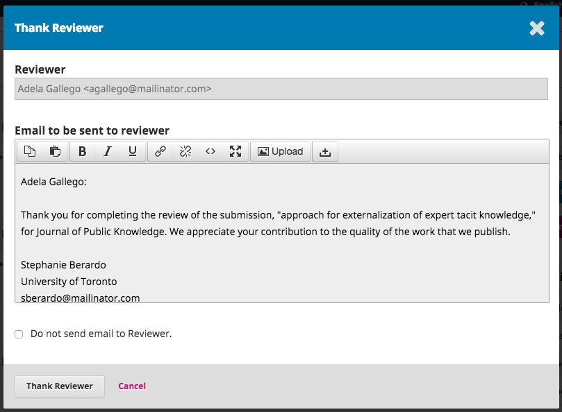
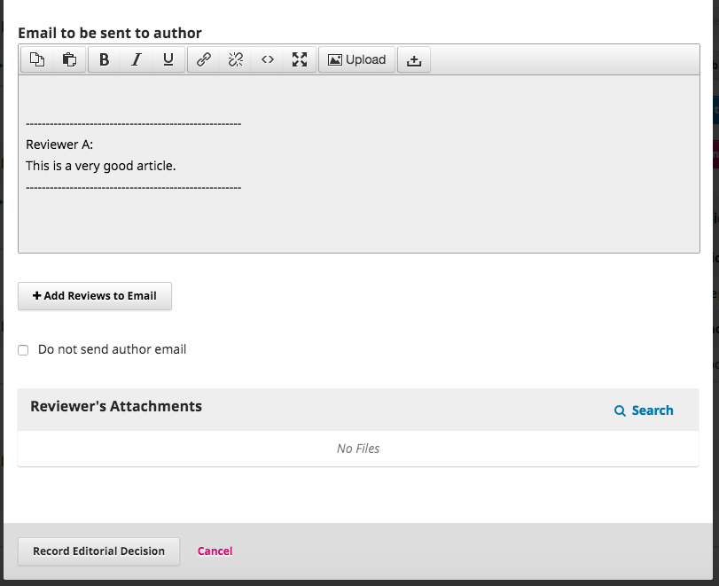

# Review

When the submission enters the Review Stage, a notification indicates that some reviewers need to be assigned.

From the Reviewers panel, she can select Add Reviewer to assign a new reviewer.

This opens a new window, where the reviewers are listed and can be selected, one at a time.

Note the details visible about the reviewers, including their interests, past assignments, etc.

At the bottom of this form, you will see options to:

**Select Reviewer**: Use this once you have picked a reviewer.

**Create New Reviewer**: If none of the reviewers are suitable, you can use this button to create a new reviewer. This is a new account in the system.

**Enroll Existing User**: If none of the reviewers are suitable, you can enroll an existing user as a reviewer.

For this demonstration, we will pick Adela as our reviewer and hit the **Select Reviewer** button.

This initiates a new window with a message for the reviewer.

You can revise any of the prepared text.

Further down the form, you will also see additional details to be sent to the reviewer, including the title and abstract, important dates, and a link to the files to be reviewed.

Hit the **Add Reviewer** button to send the message and assign the reviewer.

Back on the Review Stage, we can see the reviewer is now listed.

Using the blue arrow toggle next to the reviewer name, you can make additional changes.

**Review Details**: Provides details on the review.

**Email Reviewers**: Allows you to send a message to the reviewer.

**Edit Review**: Allows you to change the review dates and files.

**Unassign Reviewer**: Allow you to unassign the reviewer.

**History**: Provides a brief history of the review.

At this point, we could add additional reviewers, and then wait for their recommendations to come in.

##Responding to Reviews

Once the reviewers have completed their work, the section editor can see the results of their work in the dashboard, including notifications that new reviews have been submitted and that all reviews are in.

Use the *Read Review* link in the Reviewers panel to read the comments from the reviewers, including those for both the author and editor as well as for the editor only.

Select the **Confirm** link at the bottom of the screen.

In the Reviewers panel, you can now see a *Thank Reviewer* link. Choose that to thank the reviewer.

Hit the **Thank Reviewer** button to send the message.

##Making the Decision

Based on the reviewer recommendations, you can use the action buttons to make a decision.

Options include:

**Request Revisions**: This will require the author to make minor changes, but no further peer review is required.

**Resubmit for Review**: This will require the author to make major changes and another round of review will need to take place.

**Send to Copyediting**: This means the submission is accepted without revisions and can proceed to the Copyediting stage.

**Decline Submission**: This means that the submission has not passed peer review and is unsuitable for further consideration. The submission would then move to the Archives.

##Request Revisions
In this demonstration, we are going to request that the author make some minor revisions before acceptance.

To do so, select the **Request Revisions** button. This results in a new message window.

You can modify any of the text before sending the message.

Use the Add Reviews button to import the reviewer's comments from the Editor and Author field. Comments in the Editor only field will not be displayed.

If there are any attachments, such as marked up file created by a reviewer, you can attach it here (as long as it has been anonymized).

Hit the **Record Editorial Decision** button to send the message.

