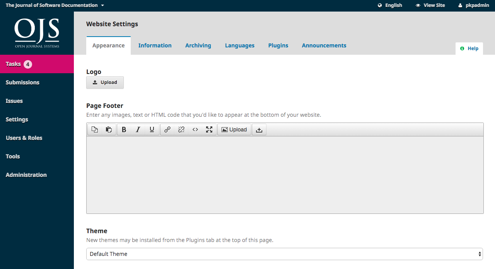
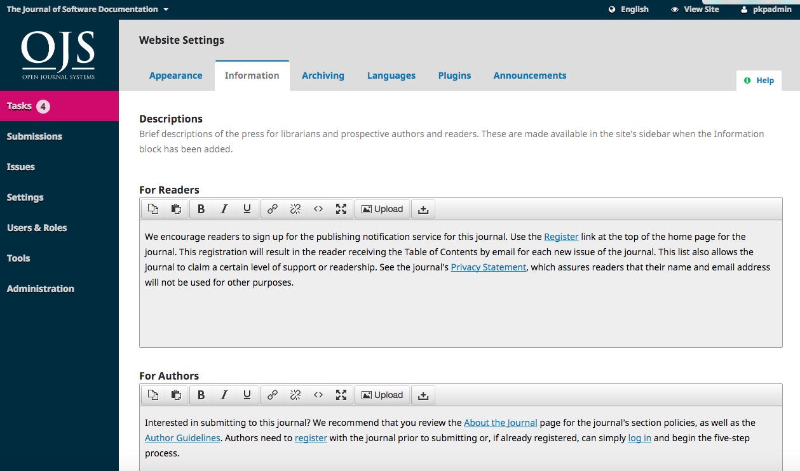

# Website Settings

The Website Settings allow you to configure how your journal's website looks and operates. It consists of tabs for Appearance, Information, Archiving, Languages, Plugins, and Announcements.

##Appearance

**Logo**: Use this space to upload a journal logo to the upper left corner of your reader interface.

**Page Footer**: This allows you to display text at the bottom of each page of your website.

**Theme**: As new themes become available, you can enable them here.

**Journal Style Sheet**: Use this to upload a unique style sheet for your journal.

**Sidebar Management**: This allows you to move different blocks in or out of the sidebar in the reader interface.

**Homepage Image**: Uploading an image here will will place it on your journal's home page.

**Journal Favicon**: Add a [favicon](https://en.wikipedia.org/wiki/Favicon) to display in the reader's browser address bar.

**Additional Content**: Any text entered here will appear on your homepage.

**Lists**: Limit the number of items (for example, submissions, users, or editing assignments) to show in a list before showing subsequent items in another page. Also, limit the number of links to display to subsequent pages of the list.

**Journal thumbnail**: Upload a small logo or image representative of the journal that will be used in lists of journals on this OJS installation. This will only be used on OJS installations with multiple journals.

Hit **Save** to record your changes.

##Information

Use these fields to modify the text in the For Readers, For Authors, For Librarians pages on the journal website.

Remember to hit **Save** to record any changes.