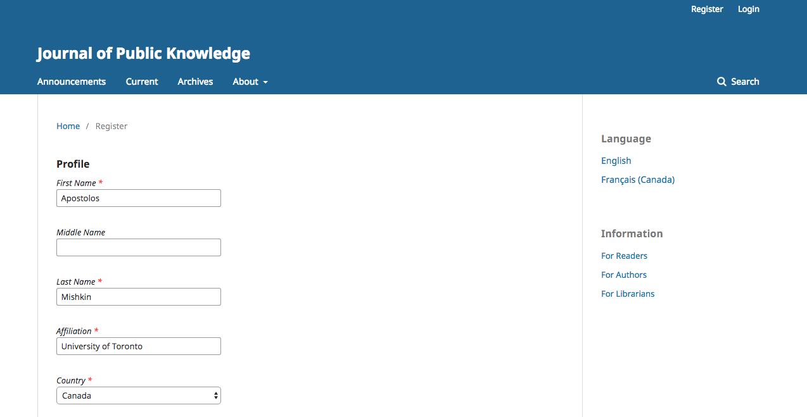

# Rekisteröityminen julkaisuun

Lehden ylläpito voi kytkeä rekisteröitymistoiminnon pois päältä, jolloin järjestelmä ilmoittaa, että rekisteröityminen on suljettu.

Aloita rekisteröityminen valitsemalla Rekisteröidy-linkki sivun oikeasta yläkulmasta. Lehden ulkoasu voi olla hieman erilainen.

Tämä avaa rekisteröitymislomakkeen, johon pitää täyttää siinä vaadittavat tiedot.

Kaikki tähdellä merkityt kentät (etunimi, sukunimi, affiliaatio, maa, sähköposti, käyttäjätunnus sekä salasana) ovat pakollisia. Jos lehti on monikielinen, sinun pitää valita haluamasi ensisijainen kieli.

Sinut rekisteröidään automaattisesti Lukijaksi ja voit mahdollisesti valita myös Arvioijan roolin. Tällöin lehden toimituskunta voi tarjota sinulle käsikirjoituksia arvioitavaksi. Kirjoittajan roolin saat käsikirjoituksen lähetyksen yhteydessä.

Mikäli tarvitset jonkin toisen käyttäjäroolin, ota yhteyttä lehden toimituskuntaan.
