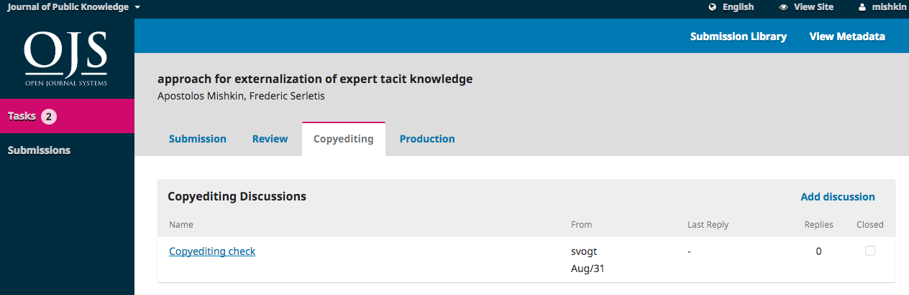
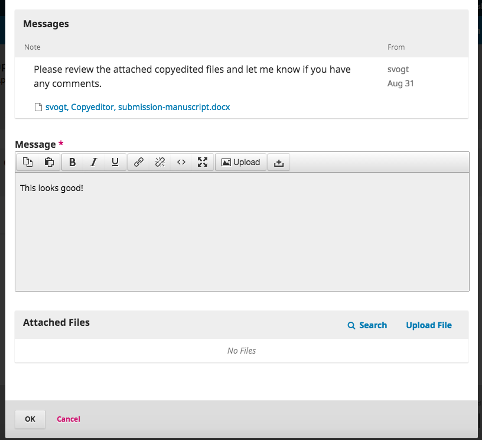
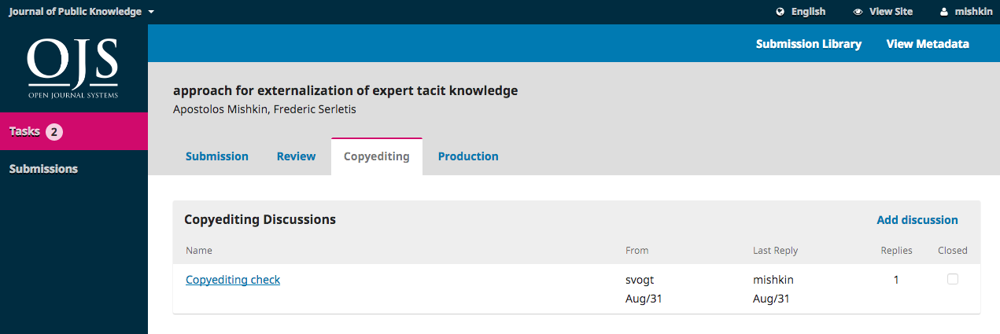

# Vastaaminen teknistä toimittamista koskevaan pyyntöön

Teknisen toimittamisen työvaiheen eteneminen voi vaihdella julkaisusta riippuen.

Voit kuitenkin saada teknisesti toimitetun käsikirjoituksen tarkistettavaksi tai vastaavasti toimittaja voi pyytää sinua tekemään joitakin korjauksia. Joidenkin julkaisujen tapauksessa sinuun saattaa olla yhteydessä erikseen määrätty julkaisun tekninen toimittaja.

Näissä tapauksissa toimittaja on yhteydessä keskustelutoiminnon välityksellä. Keskusteluviestit näkyvät teknistä toimittamista koskevassa työvaiheessa, eli viestit eivät näy esimerkiksi arviointivaiheen keskusteluissa.

Saat uusista keskusteluviesteistä sähköpostin. Siirry lehden sivuille ja kirjaudu sisään hallintapaneeliin.

Näet käsikirjoituksesi hallintapaneelin listauksissa. Paina Tekninen toimitus -linkkiä ja siirryt käsikirjoituksessasi oikeaan työvaiheeseen.

Paina keskustelun otsikkoa avataksesi viestin. Olet todennäköisesti saanut toimittajalta ohjeita sekä liitetiedostona olevan käsikirjoituksen.

Mikäli sinua on pyydetty vain tarkistamaan käsikirjoitus, voit sen luettuasi vastata toimittajan keskusteluviestiin.

Mikäli sinua olisi pyydetty tekemään itse korjauksia, voisit liittää nyt korjatun käsikirjoituksen keskusteluviestisi liitteeksi. Tässä tapauksessa ilmoitamme vain, että käsikirjoitus on omasta puolestasi kunnossa. Kirjoita viesti ja paina **OK**.

Näet nyt keskustelutoiminnosta, että olet viimeinen keskusteluun vastannut henkilö.

Mahdollisesti käsikirjoitusta tarkistetaan ja korjataan vielä uudestaan ja tällöin kommunikointi tapahtuu edelleen keskustelutoiminnon kautta.

Kun käsikirjoitus on valmis taitettavaksi, se siirtyy tuotantovaiheesee, mistä saat ilmoituksen toimittajalta.