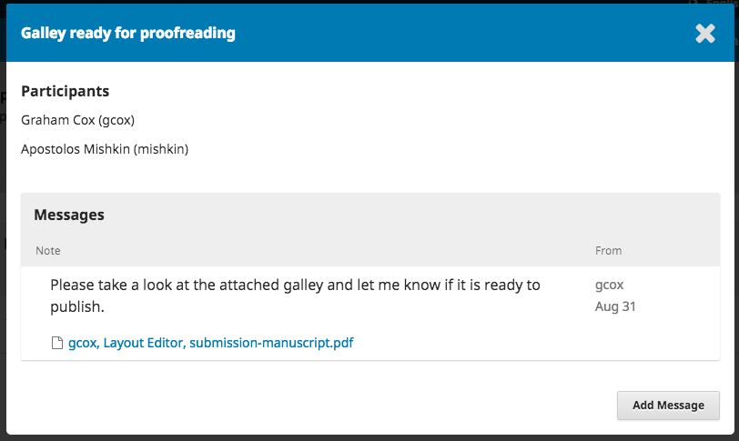

# Vastaaminen oikolukua koskevaan pyyntöön

Jotkin julkaisut voivat pyytää kirjoittajaa oikolukemaan oman käsikirjoituksensa taitetun version. Tämä tarkoittaa käytännössä pienten kirjoitusvirheiden jne. etsimistä, eli ei varsinaisia sisältöön liittyviä muutoksia. On myös lehtiä, jotka oikolukevat artikkelit itse, jolloin kirjoittaja ei enää osallistu käsikirjoituksen käsittelyyn.

Mikäli lehti pyytää oikolukua, toimittaja on yhteydessä keskustelutoiminnon välityksellä. Keskusteluviestit näkyvät tuotantoa koskeva työvaiheessa, eli viestit eivät näy esimerkiksi arviointivaiheen keskusteluissa. Joidenkin julkaisujen tapauksessa sinuun saattaa olla yhteydessä erikseen määrätty julkaisun taittaja.

Saat viestin, jossa kerrotaan oikoluettavien tiedostojen olevan valmiina. Siirry lehden sivuille ja kirjaudu sisään hallintapaneeliin.

Näet käsikirjoituksesi hallintapaneelin listauksissa. Paina Tuotanto-linkkiä ja siirryt käsikirjoituksessasi oikeaan työvaiheeseen.

Paina keskustelun otsikkoa avataksesi viestin. Olet todennäköisesti saanut toimittajalta ohjeita sekä liitetiedostona olevan käsikirjoituksen.

Tarkistettuasi käsikirjoituksen, voit vastata toimittajan keskusteluviestiin ja ilmoittaa mahdolliset korjauspyynnöt.

Oikoluvun jälkeen oma osuutesi käsikirjoituksen käsittelyssä on valmis.
