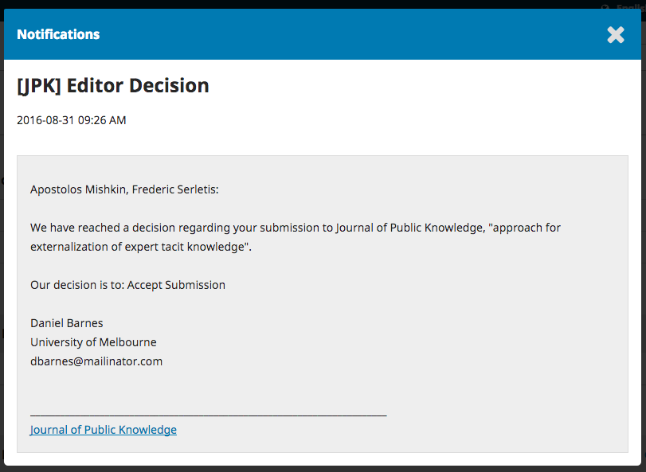

 #Vertaisarviointiin vastaaminen
 
Kun vertaisarviointi on valmis, toimittaja ilmoittaa sinulle sähköpostitse päätöksistä.

Sähköpostin saatuasi siirry lehden sivuille ja kirjaudu omaan hallintapaneeliisi. 

Valitse *Arviointi* linkki käsikirjoituksesi nimen vieressä.

Siirryt käsikirjoituksesi työnkulkuun, jossa olet parhaillaan arviointivaiheessa. Näkymän yläosassa lukee toimittajan päätös ja siinä oleva linkki johtaa toimittajan lähettämään viestiin.

Tee lähettämääsi käsikirjoitukseen toimittajan ja arvioijien esittämät muutokset.

##Uuden version lähetys

Kun muokattu käsikirjoitus on valmis, siirry lehden sivuille ja kirjaudu hallintapaneeliin. Valitse *Arviointi* linkki käsikirjoituksesi nimen vieressä.

Avautuvalta sivulta löydät laatikon, joka on otsikoitu **Korjaukset**.

Valitse *Lataa tiedosto*.

Valitse vetovalikosta se tiedosto, jonka uutta versiota olet lataamassa.

Lataa tämän jälkeen uusi tiedosto ja valitse **Jatka**.

Tarkista tiedoston nimi ja valitse uudelleen **Jatka**. Tavallisesti nimeä ei tarvitse muuttaa.

Voit halutessasi ladata myös muita uusia tiedostoja. Kun olet valmis, valitse **Suorita**.

Korjattu käsikirjoitustiedostosi on nyt Korjaukset-laatikossa.

##Ilmoita toimittajalle

On suositeltavaa ilmoittaa toimittajalle erillisellä viestillä korjatun käsikirjoituksen lähettämisestä. 

Avoinna olevalla sivulla näkyy Keskustelut-laatikko.

Valitse **Lisää keskustelu**.

Valitse kohdasta *Lisää käyttäjä* toimittajan nimi.

Anna otsikko ja kirjoita viesti, jossa ilmoitat uuden käsikirjoituksen lähettämisestä. Tarvittaessa voit myös kertoa, miten olet ottanut tehdyt muutosehdotukset huomioon.

Valitse **OK** viestin lähettämiseksi.

Toimittaja saa nyt keskustelusta uuden viestin ja voi tarvittaessa vastata siihen. Keskinäisen keskustelunne viestit näkyvät arviointivaiheen keskustelulaatikossa.

Tässä vaiheessa jäät odottamaan toimittajan vastausta ja arviota siitä, ovatko tehdyt muutokset riittäviä.

##Muutokset hyväksytty

Kun toimittaja on hyväksynyt käsikirjoituksesi julkaistavaksi, saat uuden toimittajan tekemän päätöksen sähköpostitse. Näet myös hallintapaneelista päätöstä koskevan ilmoituksen.

Jälkimmäinen päätös on viimeisin. Voit avata sen painamalla päätöksen otsikkoa. Sieltä löytyvä teksti on sama kuin sähköpostissa.

Alempana keskustelulaatikossa voit myös nähdä vastauksen toimittajalta.

Keskustelun otsikon painaminen avaa keskusteluketjun.

Käsikirjoituksesi on nyt siirtynyt teknisen toimittamisen vaiheeseen.