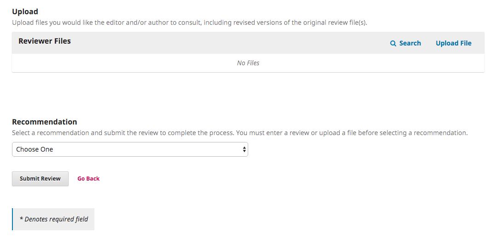

#Luku 11: Arviointi

Julkaisun arvioijaksi voi tulla joko ilmoittamalla halukkuutensa julkaisuun rekisteröitymisen yhteydessä tai vastaavasti julkaisun toimittajan kutsusta.

Mikäli olet saanut kutsun arvioijaksi, saat todennäköisesti kaksi sähköpostiviestiä lähes peräkkäin. Näistä ensimmäisessä ilmoitetaan, että sinua on pyydetty arvioijaksi ja kerrotaan käyttäjätiliisi liittyvät yksityiskohdat. Jos sinulla ei ollut ennestään käyttäjätilia, näet myös salasanasi, joka sinun pitää vaihtaa ensimmäisen kirjautumisen jälkeen. Jos haluat kieltäytyä kokonaan tekemästä arviointeja kyseessä olevalle julkaisulle, kieltäydy annetusta arviointipyynnöstä alla olevien ohjeiden mukaisesti ja ilmoita vielä erikseen toimittajalle, että et halua uusia pyyntöjä enää jatkossa.

Toinen sähköpostiviesti sisältää varsinaisen arviointipyynnön. Mikäli olet jo ennestään lehden arvioija, saat vain tämän viestin.

Lue saamasi viesti, siirry lehden kotisivuille ja kirjaudu sisään hallintapaneeliin. Joidenkin julkaisujen tapauksessa viesti saattaa sisältää linkin, joka kirjaa sinut suoraan sisään ja siirtää sinut arviointilomakkeeseen.

Näet hallintapaneelin listauksissa saapuneet työt. Paina oikean työn perässä olevaa Arviointi-linkkiä. Tässä tapauksessa lehdellä on aktivoituna tuplasokkoarviointi, eli et näe kirjoittajan nimeä.

Siirryt arviointilomakkeen ensimmäiseen vaiheeseen. 

Näkymässä näet arvioitavan artikkelin tiedot. Joidenkin julkaisujen tapauksessa voit nähdä jo tässä vaiheessa myös koko artikkelin tekstin.

Linkistä **Katso käsikirjoituksen yksityiskohdat** avautuu ikkuna, josta näkyy artikkelin metadata.

Sivun alaosassa näkyy arviointia koskeva aikataulu sekä arvioinnin vastaanottoon liittyvät painikkeet.

Mikäli hylkäät arviointipyynnön, järjestelmä avaa uuden ikkunan, jossa on esitäytetty viesti toimittajalle. Voit muokata valmista tekstiä haluamallasi tavalla ja lähettää viestin. Arviointiprosessi on tällöin päättynyt omalta osaltasi ja toimittaja on saanut tiedon kieltäytymisestä.

Mikäli hyväksyt arviointipyynnön, siirryt lomakkeen toiseen vaiheeseen. Tällä sivulla näkyvät lehden arviointiohjeet, joihin tulee perehtyä huolellisesti. Ohjeisiin pääsee käsiksi vielä myöhemminkin.

Valitse **Jatka** ja siirryt kolmanteen vaiheeseen.

Tällä sivulla näet viimeistään arvioitavaksi tarkoitetun käsikirjoituksen sekä sen mahdolliset liitteet. Voit ladata tiedoston painamalla sen otsikkoa.

Tiedostojen alapuolella on varsinainen arviointilomake. Oletuksena siinä on kaksi viestikenttää, mutta joillakin julkaisuilla voi olla käytössä laajempi arviointilomake.

Oletuslomakkeessa ensimmäisen kentän teksti on tarkoitettu sekä kirjoittajalle että toimittajalle ja toinen kenttä vain toimittajalle.

Once you have read the paper and added your comments, scroll down the page to optionally upload a marked up copy of the review file (remember to strip any personal identification from the file before uploading it). 

Next, you must then make your recommendation using the dropdown menu.

Your choices include: 

**Accept Submission**: it is ready to go to Copyediting as is.

**Revisions Required**: it requires minor changes that can be reviewed and accepted by the editor.

**Resubmit for Review**: it requires major changes and another round of peer review.

**Resubmit Elsewhere**: it doesn’t seem like a good fit for the focus and scope of this journal.

**Decline Submission**: it has too many weakness to ever be accepted.

**See Comments**: if none of the above recommendations make sense, you can leave a comment for the editor detailing your concerns.

Finally, hit the Submit Review button to complete your task. You’ll be asked to confirm.

Hit OK. You will be taken the final confirmation screen thanking you for your work.

That's it! The review is now complete.

