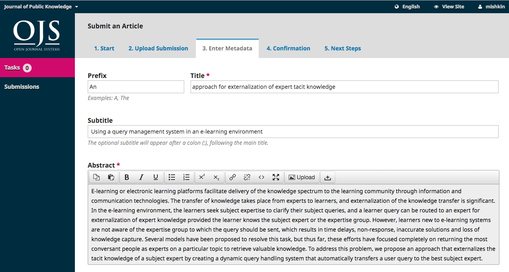
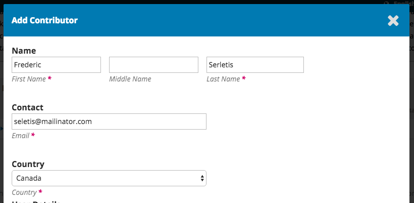
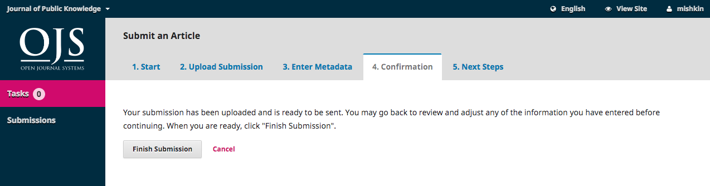

# Käsikirjoituksen lähetys

Rekisteröitymisen jälkeen voi kirjautua sisään. Pääset lähettämään käsikirjoitusta valitsemalla "Lähetä käsikirjoitus" yläpalkista tai menemällä valikkoon "Tietoa" => "Käsikirjoitukset", josta valitset toiminnon "Lähetä uusi käsikirjoitus".

Mikäli olet jo siirtynyt käyttäjän hallintapaneeliin, aloita käsikirjoituksen lähetys valitsemalla **Uusi käsikirjoitus** näkymän oikeasta reunasta.

Toiminto avaa viisiportaisen lomakkeen, jossa käsikirjoitus lähetetään ja kuvaillaan.

##Vaihe 1

Ensimmäisessä vaiheessa täytetään joitakin käsikirjoituksen perustietoja. Sivulla näkyvät kohdat riippuvat osittain lehden asetuksista, eli kaikkia alla mainittuja kohtia ei välttämättä näy.

Valitse käsikirjoituksen kieli vetovalikosta.

Valitse käsikirjoitukselle sopiva osasto. Jos et ole varma valinnastasi, niin valitse sopivin. Toimituskunta pääsee vaihtamaan osastoa vielä useaan kertaan prosessin aikana.

Lue ja hyväksy tekijänoikeuksiin liittyvät ehdot.

Lue ja hyväksy tarkistuslistassa olevat kohdat. Mikäli käsikirjoituksesi ei täytä ehtoja, tee tarvittavat korjaukset ennen etenemistä.

Lue tietosuojaseloste.

Valitse **Tallenna ja jatka**, jolloin siirryt seuraavaan vaiheeseen.
 
##Vaihe 2

Toisessa vaiheessa pääset lisämään käsikirjoitukseen liittyviä tiedostoja. Ruudulle avautuu uusi pieni ikkuna, joka sisältää kolmiportaisen lomakkeen. 

Valitse ensin Artikkelin osa. Valinnalla määritetään, että onko kyse varsinaisesta käsikirjoitustiedostosta vai mahdollisesti jostakin liitetiedostosta. **Pääset lataamaan tiedostoa vasta valinnan jälkeen**. Tavallisesti oikea vaihtoehto on "Artikkelin teksti".

Valinnan tehtyäsi pääset lataamaan ensimmäisen tiedoston. Huomaa, että voit ladata vain yhden tiedoston kerralla. Valitse **Lataa tiedosto** ja etsi oikea tiedosto tietokoneeltasi. Kun tiedosto on siirtynyt, valitse **Jatka**. 

Tiedoston siirron jälkeen voit nimetä sen halutessasi uudelleen, mutta tavallisesti oletuksena annettu nimi riittää. Mikäli olet lisäämässä liitetiedostoa, näkymässä on lomake, johon voit täyttää tiedoston kuvailutiedot.

Valitse **Jatka**.

Ensimmäisen tiedoston lisäys on nyt valmis. Voit lisätä uusia tiedostoja valitsemalla **Lisää toinen tiedosto**. Kun olet lisännyt kaikki tiedostot, valitse **Suorita**, jolloin ikkuna sulkeutuu.

Näkyville tulee lomakkeen toinen vaihe, jossa on nyt listattuna kaikki lisäämäsi tiedostot. Mikäli sinun pitää tehdä tiedostoihin muutoksia, voit painaa tiedoston nimen edessä olevaa sinistä kolmiota, josta pääset joko muokkaamaan tai poistamaan ko. tiedoston. Huomaa, että muokkaus koskee vain tiedoston kuvailutietoja. Voit myös jatkaa tiedoston lataamista valitsemalla **Lataa tiedosto**.

Valitse **Tallenna ja jatka**, jolloin siirryt lomakkeen kolmanteen vaiheeseen.

##Vaihe 3

Kolmannessa vaiheessa täytetään käsikirjoituksen kuvailutiedot. **Muista täyttää käsikirjoituksen kuvailutiedot huolellisesti**.

Täytä käsikirjoituksen otsikko (kolmessa osassa, joista prefiksi koskee vain joitakin kieliä) sekä abstrakti.

Mikäli lehti on monikielinen, myös kuvailutiedot voi täyttää usealla kielellä. Tällöin esimerkiksi otsikko-kenttää painaessa avautuu jokaiselle kieliversiolle oma tekstikenttä, johon voi kirjoittaa.

Absraktin alapuolella on tekijäluettelo. Oletuksena käsikirjoitusta lähettävän kirjoittajan tiedot näkyvät valmiina.

You can add more contributors (e.g., co-authors), by clicking the **Add Contributors** link. This will open a new window with fields to enter their information.

Mikäli tarvitaan muita kirjoittajia, valitse kohta **Lisää tekijä**. Tämä toiminto avaa uuden lomakkeen, johon kirjoittajan tiedot täytetään. Huomaa, että tarvitset kirjoittajien sähköpostiosoitteet.

Valitse **Tallenna** ja uusi tekijä lisätään luetteloon.

Riippuen julkaisun asetuksista ja kirjoittajaohjeista voit nähdä tekijäluettelon alla myös muita kuvailutietoja koskevia kenttiä, kuten avainsanat.

Avainsanojen tapaisten kenttien kohdalla erota annetavat sanat painamalla aina enter-nappia sanan kirjoittamisen jälkeen.

Kun kuvailutiedot on tarkistettu valitse **Tallenna ja jatka**.

##Vaihe 4

On Step 4, you will be asked to confirm that you are happy with your submission. 

Neljännessä vaiheessa sinua pyydetään varmistamaan, että olet valmis lähettämään käsikirjoituksen.

Valitse **Suorita lähetys**.

Varmistus kysytään vielä uudelleen avautuvassa ikkunassa. Valitse **OK**.

##Vaihe 5

Käsikirjoitus on nyt lähetetty! Toimittajat ovat saaneet tiedon uudesta käsikirjoituksesta. 

##Hallintapaneeli

Käsikirjoituksesi näkyy nyt käyttäjän hallintapaneelissa kohdassa **Omat kirjoitukseni**. Käsikirjoituksen otsikon perässä näkyy käsikirjoituksen työvaihe ja otsikkoa painamalla pääset katsomaan toimitusprosessia koskevaa näkymää kirjoittajan näkökulmasta.

Käsikirjoitus etenee toimitusprosessissa ja toimittajat ovat sinuun yhteydessä järjestelmän kautta.
